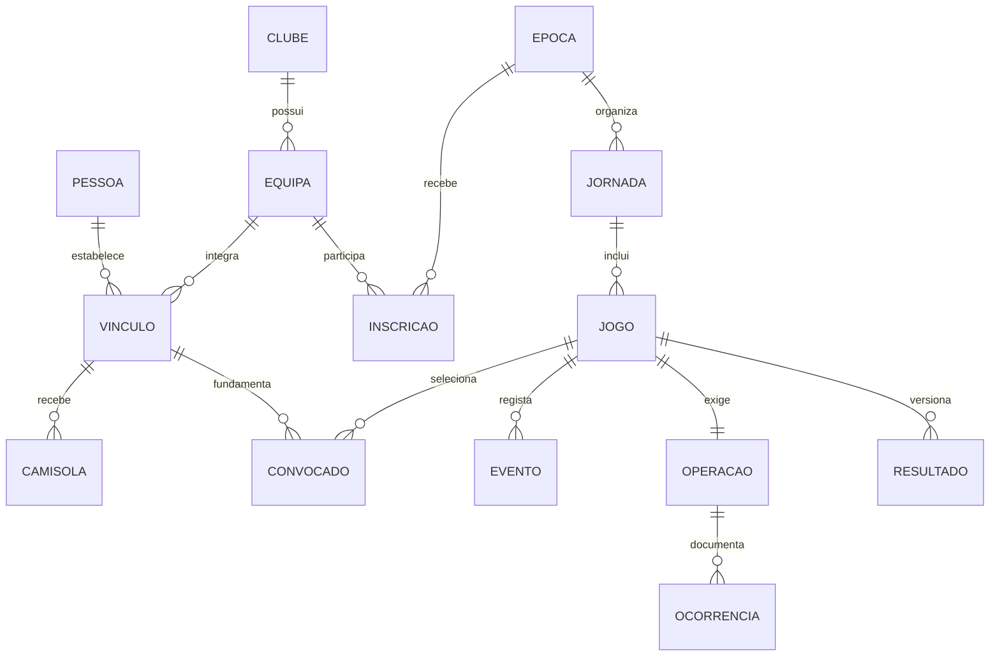

# NEXUS-CUP V1.0 — relatório de fecho

Data: 20 de setembro de 2026. Fecho antecipado por instrução expressa do utilizador: parar pesquisas, testes e alterações funcionais, conservar o estado e produzir relatório/handoff.

**Estado: reconstrução funcional com testes executados; não certificada como integralmente concluída face a todos os requisitos originais.** Os últimos resultados guardados são **44 + 9 + 14 = 67 verificações aprovadas**, sem falhas nessas três execuções finais. Estes números descrevem a cobertura executada, não a conclusão de todos os requisitos. Depois da ordem de paragem apenas foram lidos os relatórios existentes e escrita esta documentação; não se repetiram testes nem consultas à BD.

## 1. Ponto recuperado da execução interrompida

A pasta canónica estava vazia no início. A referência foi `E:\SW-CYBER\Nexus-CUP-VFINAL`, utilizada exclusivamente em leitura.

O estado recuperável mais recente encontra-se nestes ficheiros:

| Ficheiro da referência | Última modificação registada, UTC | Estado observado |
|---|---|---|
| `database/12_v1_final.sql` | 2026-09-20 14:10:02.734 | Upgrade operacional, tempo por período, sequência, readiness e nova competição; com incompatibilidades |
| `database/08_liga_placard_2025_26.sql` | 2026-09-20 14:11:36.570 | Adição de faltas, substituições e participantes ao histórico; último SQL alterado observado |
| `frontend/server.js` | 2026-09-20 14:08:35.954 | Integração parcial de cockpit, ações e simulação |
| `frontend/public/index.html` | 2026-09-20 14:08:06.332 | Alteração da interface |
| `installer/Install-TacaNexus.ps1` | 2026-09-20 14:08:06.347 | Instalador anterior com lógica a substituir |

**Limite da recuperação:** não foi localizado um registo local da sessão anterior com a working directory VFINAL. Não é possível provar o último comando executado, a transação em curso ou um eventual resultado de teste anterior. Os timestamps e conteúdos acima são evidência de ficheiros, não um histórico completo da execução. O uso anterior de `.test_pgdata` da árvore `NEXUS-CUP` foi comunicado pelo utilizador; esta execução não o reproduziu nem inspecionou esse cluster.

Problemas observados: substituição `2P` com minuto 27 incompatível com limite de 20 minutos por período; migração de tempo que podia truncar valores; atribuição de sequência sem serialização explícita; finalização sem exigir 40:00; readiness que podia aceitar inexistência de operação de segurança; endpoint artificial de breach; instalador com tentativa de terminar processos pela porta. Não se transportou esta combinação para a instalação nova.

## 2. Ficheiros antigos analisados

O [inventário com hashes SHA-256](reference-inventory.json) contém 22 ficheiros-fonte, dimensões, timestamps e objetos SQL encontrados. A leitura e análise funcional foram seletivas; o inventário não significa revisão integral de cada linha.

- SQL: `01_schema.sql`, `02_functions.sql`, `03_triggers.sql`, `04_procedures.sql`, `05_views.sql`, `06_seed.sql`, `07_tests.sql`, `08_liga_placard_2025_26.sql`, `09_integrity_checks.sql`, `09_integrity_readonly.sql`, `10_upgrade_v3.sql`, `11_auth_admin.sql`, `11_auth_upgrade.sql`, `12_v1_final.sql`.
- Backend/frontend: `frontend/server.js`, `frontend/classificacao.js`, `frontend/classificacao.test.js`, `frontend/public/app.js`, `frontend/public/classificacao.js`, `frontend/public/index.html`, `frontend/public/style.css`.
- Instalador: `installer/Install-TacaNexus.ps1`.
- Também consultados: `README.md` e `package.json` da referência.

Não foi necessário reutilizar nem alterar outras variantes do projeto. Não foram copiados pgdata, node_modules, logs, chaves ou segredos antigos.

## 3. Componentes reutilizados

Reutilização **conceptual**, com implementação nova: separação de domínios em schemas; relações clube/equipa/pessoa; trigger temporal de camisola; resultados versionados; auditoria em camadas; cifra do payload forense e cadeia SHA-256; direção visual clara com sidebar e tabelas.

Não houve cópia integral da árvore nem importação de um módulo legado declarado validado. Os conceitos foram reimplementados e os testes dizem respeito ao código novo.

## 4. Componentes reconstruídos

Baseline SQL, integridade temporal, motor de eventos, convocatória, disciplina no jogo, inferioridade, substituições, relógio, segurança independente, homologação, versões de resultado, intenções e desfechos, RBAC, sessões, backend HTTP, frontend, simulador persistente, datasets, instalador e suites de testes.

## 5. Componentes descartados e classificação

| Componente anterior | Classificação | Decisão |
|---|---|---|
| Conceitos relacionais e trigger temporal | REUTILIZÁVEL como referência | Reimplementados e testados |
| Cifra/cadeia forense e correlação | PARCIAL / REFACTOR | Nova implementação e novas chaves |
| Upgrade operacional `12_v1_final.sql` | PARCIAL / INCORRETO em regras observadas | Substituído por baseline |
| Dataset Liga Placard | A RECONSTRUIR | Substituído por TAÇA NEXUS fictícia e nova NEXUS CUP |
| Simulação apenas prevista e não persistente | OBSOLETO para o objetivo | Simulador usa o mesmo motor da operação manual |
| Endpoint de breach controlado | INCORRETO para o objetivo | Não existe no produto novo |
| Gestão de processos por porta no instalador | INCORRETO | Eliminada |
| Upgrades V3 e auth sobrepostos | OBSOLETO para instalação limpa | Não transportados |
| Logs, caches, pgdata e segredos anteriores | FORA DO PRODUTO | Não copiados |

## 6. Estrutura final e requisitos académicos

```text
NEXUSCUP/
  INSTALAR.cmd
  INICIAR.cmd
  package.json / package-lock.json / .gitignore
  database/
    01_schema.sql
    02_integrity.sql
    03_engine.sql
    04_api.sql
    05_seed.sql
  backend/
    config.mjs
    server.js
  frontend/
    index.html
    style.css
    app.js
  installer/
    database.mjs
    install.mjs
    Install.ps1
    Start.ps1
  tests/
    bootstrap.mjs
    run.mjs
    rules.mjs
    ui.mjs
  docs/
    reference-inventory.json
    RELATORIO_FINAL.md
    HANDOFF.md
  test-results/           evidências locais dos testes
  .runtime/               configuração temporária dos testes; contém segredos
  .test_pgdata/            cluster criado nesta execução
  .test_pg.log
  node_modules/           dependências instaladas de novo
```

Os diretórios runtime, dependências e cluster não são fontes para distribuição; estão excluídos pelo `.gitignore`. A limpeza/empacotamento final não foi realizada após a ordem de paragem.

Modelo conceptual resumido:



O modelo lógico é o DDL de `01_schema.sql`. Jogadores e treinadores são funções do vínculo; golos e cartões são tipos de evento, em vez de tabelas redundantes. Existem relações 1:N e N:N com tabelas associativas (`inscricao`, `efetivo`, `utilizador_role`), PK/FK, constraints e PL/pgSQL demonstráveis.

As cinco consultas académicas estão implementadas nos relatórios. Exemplos de consulta SQL para demonstração pelo proprietário da BD — não executados novamente no fecho:

```sql
-- Jogos por jornada e resultados
SELECT jornada, casa, fora, estado, golos_casa, golos_fora
FROM competicao.v_jogos_resultados WHERE epoca_id = 1 ORDER BY jornada, id;
-- Jogadores por clube
SELECT clube, equipa, nome, numero FROM clubes.v_jogadores_clubes
WHERE funcao = 'JOGADOR' ORDER BY clube, nome;
-- Golos por jogador
SELECT jogador, count(*) FROM jogo.v_eventos
WHERE tipo = 'GOLO' AND valido GROUP BY jogador;
-- Cartões num jogo
SELECT tempo, seq, jogador, tipo FROM jogo.v_eventos
WHERE jogo_id = 1 AND tipo IN ('AMARELO','VERMELHO_DIRETO','EXPULSAO_SEGUNDO_AMARELO')
ORDER BY seq;
-- Resultados oficiais versionados
SELECT jogo_id, versao, casa, fora, motivo FROM competicao.resultado
ORDER BY jogo_id, versao;
```

Uma documentação académica autónoma mais extensa, com dicionário completo de atributos e justificação de normalização, permanece PENDENTE.

## 7. Alterações de schema

- Baseline determinístico em cinco ficheiros; o instalador aplica-o numa transação e recusa schemas já ocupados.
- Separação de vínculo temporal e atribuição temporal de camisola.
- Separação de plantel, convocatória e estado desportivo no jogo.
- Tempo numérico por período, PK de evento e sequência única por jogo, atribuída sob bloqueio.
- `INTERVALO` é fase do jogo, não um nono estado administrativo.
- Segurança obrigatória criada por trigger com ciclo próprio.
- Resultado live derivado de eventos válidos; revisões e versões oficiais acrescentadas sem apagar histórico.
- Intenção e desfecho em tabelas separadas; exceções tratadas com preservação da evidência.
- Role de ligação à BD sem DML direto e com funções públicas de acesso muito limitadas.

## 8. Tabelas finais por schema

O baseline define **35 tabelas em nove schemas de aplicação**:

| Schema | Tabelas |
|---|---|
| `app` | `versao`, `utilizador`, `role`, `utilizador_role`, `super_autorizado`, `sessao` |
| `nucleo` | `pessoa` |
| `clubes` | `clube`, `equipa`, `vinculo`, `camisola` |
| `competicao` | `recinto`, `epoca`, `inscricao`, `jornada`, `jogo`, `resultado` |
| `jogo` | `convocado`, `evento`, `reducao`, `revisao` |
| `arbitragem` | `oficial`, `nomeacao` |
| `seguranca` | `entidade`, `agente`, `operacao`, `efetivo`, `ocorrencia`, `correcao` |
| `auditoria` | `intencao`, `desfecho`, `operacional`, `meta` |
| `forense` | `registo`, `checkpoint` |

Não existe, nesta reconstrução, schema autónomo de processos/sanções disciplinares FPF nem catálogo versionado de regulamentos. São limitações declaradas.

## 9. PK/FK e constraints principais

Identidades integer/bigint para entidades, UUID para intenção/correlação e hash para sessão. PK compostas nas associações. FK compostas ligam jornada à época, equipas às inscrições e participantes ao jogo. UNIQUE para pairing por época, sequência por jogo, versão por jogo, pessoa e número na convocatória, função e oficial na nomeação, operação por jogo e desfecho por intenção.

CHECK para equipas distintas, oito estados administrativos, período 1/2, segundos 0–1200, camisola 1–99, intervalos temporais válidos, tipos de eventos e de entidade, 40:00 para finalização/homologação, feridos não negativos e justificações obrigatórias de assistência/força. NIF único com formato de nove dígitos; não é validação externa de identidade fiscal.

## 10. Triggers

- `validar_vinculo`: sobreposição e preservação de vínculo histórico.
- `validar_camisola`: sobreposição por equipa/número ou vínculo, com advisory lock; sem `btree_gist`.
- `validar_convocado`: vínculo, data, camisola, equipa, limites e estado derivado.
- `validar_nomeacao`: conflito de oficial numa reserva operacional de duas horas.
- `validar_jogo`: identidade, recinto, agendamento e controlo de alterações de estado.
- `criar_operacao`: cria segurança obrigatória.
- `b_validar_evento` e `m_aplicar_evento`: validação, sequência, relógio e efeitos desportivos.
- `a_guardar_fecho`: exige intenção válida para objetos fechados nas tabelas abrangidas.
- `z_auditar`: antes/depois e correlação nas tabelas operacionais abrangidas.
- `imutavel`: bloqueia alteração/remoção de eventos, versões, evidência e registos históricos abrangidos.

As tabelas abrangidas por cada família estão enumeradas em `02_integrity.sql`. Não se deve inferir auditoria genérica de todos os objetos PostgreSQL: auditoria DDL/DROP do legado não foi reconstruída.

## 11. Functions

- `app.actor`, `app.correlation`, `app.has_role`, `app.command`, `app.rpc`, `app.login`, `app.health`.
- `forense.registar`, `forense.verificar`.
- `auditoria.imutavel`, `auditoria.registar`, `auditoria.guardar_fecho`.
- `clubes.validar_vinculo`, `clubes.validar_camisola`.
- `competicao.validar_jogo`, `competicao.readiness`.
- `jogo.validar_convocado`, `jogo.validar_evento`, `jogo.aplicar_evento`, `jogo.emitir`.
- `arbitragem.validar_nomeacao`, `seguranca.criar_operacao`.

As funções internas não são executáveis pela role runtime. `app.rpc`, `app.login` e `app.health` constituem a superfície autorizada dessa role.

## 12. Procedures

- `competicao.homologar`: exige readiness, cria versão oficial e fecha administrativamente.
- `jogo.simular`: emite eventos pelo motor comum, termina no segundo período aos 1200 segundos, sem homologar nem terminar segurança.

## 13. Views

- `competicao.v_jogos_resultados` — vista académica de jogos/resultados.
- `clubes.v_jogadores_clubes` — vista académica de pessoas, clubes, equipas, vínculos e números.
- `jogo.v_eventos` — timeline com validade atual, nomes e apresentação MM:SS.
- `competicao.v_classificacao` — inclui FINALIZADO/HOMOLOGADO e sinalização provisória.

## 14. Endpoints e comandos principais

| Endpoint | Finalidade |
|---|---|
| `GET /api/health` | Identificação própria, versão e disponibilidade do schema |
| `POST /api/login` | Autenticação; cookie HttpOnly/SameSite |
| `GET /api/me` | Sessão, roles e primeiro acesso |
| `GET /api/catalogo` | Épocas, equipas, recintos, jornadas e intervenientes |
| `GET /api/dashboard`, `/api/jogos`, `/api/jogo` | Operação e cockpit |
| `GET /api/planteis`, `/api/relatorio` | Plantéis e relatórios reais |
| `POST /api/command` | Ações validadas na BD |
| `GET /api/super`, `/api/super/detalhe`, `/api/super/integridade` | Supervisão restrita e meta-auditada |

Comandos: PASSWORD, LOGOUT, AGENDAR, ADIAR, CANCELAR_JOGO, RECINTO, ARBITRAGEM, CONVOCAR, REMOVER_CONVOCADO, PREPARAR_SEGURANCA, INICIAR_SEGURANCA, OCORRENCIA, FINALIZAR_SEGURANCA, EVENTO, HOMOLOGAR, SIMULAR, SIMULAR_JORNADA, INTENCAO, RETIFICAR, CANCELAR_RETIFICACAO, PESSOA, ADICIONAR_JOGADOR, NUMERO, TERMINAR_VINCULO, UTILIZADORES e CRIAR_UTILIZADOR.

Alguns comandos disponíveis na API não têm ainda uma interface completa; ver item 24.

## 15. RBAC

Roles de aplicação: ADMIN, OPERADOR, LEITOR, SUPER_AUDITOR. A role de ligação PostgreSQL é criada com nome aleatório, sem superuser/criação de BD/criação de roles e sem acesso direto às tabelas. A autorização é reavaliada na BD a partir de sessão persistida cujo token é guardado por hash.

As duas contas requeridas estão no seed, com ADMIN e SUPER_AUDITOR e presença em `app.super_autorizado`: AlfCyberCop e Paulo Ricardo Costa Ramalho. A password inicial está representada apenas por hash bcrypt, com alteração obrigatória. Os testes passaram pelo login real e mudança obrigatória.

O frontend recebe roles da sessão; não autoriza Super Auditoria por email. Um administrador normal não recebe implicitamente supervisão nem pode criá-la através do endpoint de utilizadores. A proteção local de configuração DPAPI foi escrita no instalador; o seu ciclo completo de execução por duplo clique não foi ensaiado.

## 16. Super Auditoria

A intenção é gravada antes da edição. EXECUTADA, REJEITADA e CANCELADA acrescentam desfecho; tentativas diretas sobre objetos fechados abrangidas pelo RPC também originam intenção/desfecho rejeitado. Operações correntes, como substituição e override de recinto antes do fecho, não originam RED.

A consulta fornece objeto original, utilizador, motivo, timestamp, pedido, antes/depois, auditoria, meta-auditoria, cifra descodificada sob autorização e hashes/correlação. Acesso autorizado e negado são registados. Leitor, administrador sem supervisão e visitante anónimo receberam 403 nos testes.

Limites: o detalhe agrega sobretudo a intenção e o desfecho correlacionados; não existe ainda um navegador exaustivo de toda a auditoria operacional. A página mostra intervenções e acessos com desfechos, não cinco painéis independentes para todas as categorias pedidas.

## 17. Datasets e contagens

**Contagens efetivamente afirmadas e aprovadas pelos testes:** 12 jogos históricos HOMOLOGADOS; nova competição com 1 AGENDADO e 11 NAO_AGENDADO; 24 operações de segurança; uma ocorrência histórica com uso da força. O teste também confirmou a presença de golos, faltas, substituições, amarelos e expulsões no histórico.

**Quantidades derivadas do seed aplicado com sucesso, sem censo SQL adicional no fecho:** quatro clubes, quatro equipas seniores, quatro recintos, 40 pessoas desportivas/operacionais fictícias, 28 jogadores, quatro treinadores, quatro oficiais, quatro agentes, 32 vínculos, 28 atribuições de camisola, três entidades de segurança, duas épocas, oito inscrições e 12 jornadas no total. O histórico prevê três ocorrências, uma com assistência a um ferido e uso da força, três histórias iniciais de integridade e 13 versões de resultado para 12 jogos.

O histórico é fictício e foi reconstruído na instalação: timestamps de gravação/auditoria documentam essa reconstrução, não provam operações realmente realizadas nas datas dos jogos. Não foi importada uma competição real Liga Placard.

Não foi feito um censo final de todas as tabelas de auditoria/forense. O número exato de linhas cresce com as operações e acessos dos testes e não é inventado neste relatório.

## 18. Estados reais da nova NEXUS CUP

O **estado inicial de uma instalação nova** foi verificado: exatamente 1 AGENDADO e 11 NAO_AGENDADO; nenhum iniciado automaticamente. Os testes posteriores alteraram as BDs isoladas: o E2E homologou um jogo e a suite de regras iniciou/finalizou/interrompeu outros. A suite UI usou outra BD e também homologou/retificou um jogo.

Por isso, **não se afirma que as BDs temporárias atualmente conservadas ainda tenham o estado inicial**. Não houve reposição depois do STOP. O seed é a fonte de instalação inicial; a aplicação de produção na porta 5432 não foi instalada nem iniciada nesta execução.

## 19. Testes DB/API executados

[Resultados da suite principal](../test-results/results.json): **44 PASS / 0 FAIL** na execução final guardada, BD `nexuscup_test_1789915911889`, registo de conclusão `2026-09-20T14:51:58.201Z`.

Cobertura: constraints/FK, temporalidade, concorrência, pairing, elegibilidade, imutabilidade, motor, eventos no mesmo segundo, resultado, segurança, homologação, autenticação, permissões PostgreSQL, retificação, relatórios e integridade.

[Resultados adicionais](../test-results/rules.json): **9 PASS / 0 FAIL** — situações numéricas distintas, suplente expulso, dois minutos efetivos, menos de três jogadores, simulador, arbitragem e tentativa direta pós-fecho.

Existiram falhas intermediárias, corrigidas antes das últimas execuções: ambiguidade de variável PL/pgSQL; expectativa artificial de quantidade forense; preparação concorrente que esperava um lock; erro sintático numa edição do teste; rótulos de seleção; espera de teste incompatível com transição entre dois diálogos. Os resultados finais acima não apagam essa história nem representam ensaios adicionais posteriores ao STOP.

## 20. Testes negativos

Passaram rejeições de equipa contra si, FK inexistente, número inválido, sobreposição temporal, pairing duplicado, convocado de outra equipa, escrita/apagamento histórico, fecho antecipado, força sem justificação, DML/leitura sensível pela role runtime, regresso de expulso, reposição prematura, homologação com segurança aberta, referência inválida em retificação, acesso Super não autorizado, escrita por leitor e concessão de Super Auditor por administrador comum.

A tentativa de retificação rejeitada conservou evidência e resultado REJEITADA. Foi também detetada adulteração forense deliberada num teste de proprietário, integralmente revertida por ROLLBACK. Esse teste é identificado como teste DB, não como ação do produto nem simulação artificial na UI.

## 21. E2E e frontend

O E2E HTTP real passou: não agendado → agendamento → recinto → arbitragem → segurança → convocatória → início → golo → substituição → falta → amarelo → intervalo → segunda parte → segundo amarelo/expulsão → inferioridade → golo/reposição → interrupção 31:47 → retoma 31:47 → 40:00 → finalização → ocorrência pós-jogo → homologação bloqueada → fecho da segurança → homologação → intenção/retificação → evidência Super → acesso não autorizado negado e auditado.

As transições desse percurso usaram API real. SQL de proprietário foi usado nas preparações/asserções e nos testes DB claramente separados, não para forçar a aprovação do E2E.

[Instalação/UI](../test-results/ui.json): **14 PASS / 0 FAIL**. O instalador Node criou uma BD nova, validou baseline, datasets, autenticação, backend e frontend; a UI foi depois exercitada por browser local Microsoft Edge em modo headless. O plugin Browser não tinha browser disponível. A validação incluiu login, primeiro acesso, contadores, agendamento, override, nomeação, segurança, convocatória, simulação, blockers, homologação, retificação e drilldown. Nenhum erro JavaScript foi detetado nesse percurso.

Capturas locais: [dashboard](../test-results/ui/dashboard.png), [cockpit](../test-results/ui/cockpit.png), [Super Auditoria](../test-results/ui/super-auditoria.png). Pode permanecer uma captura de falha de execução anterior; não é evidência do estado final aprovado.

Não foi executado o duplo clique Windows completo até produção em 5432. Os scripts PowerShell passaram análise sintática; isto não equivale a ensaio de DPAPI, arranque persistente ou abertura de browser pelo instalador.

## 22. Integridade forense e garantias reais

Os testes devolveram `integra=true`; a quantidade devolvida foi comparada com a quantidade real de registos no momento da verificação. O teste de adulteração devolveu integridade falsa e foi revertido.

O payload usa pgcrypto com AES-256; a cadeia usa SHA-256, referência anterior, correlação, categoria e timestamp. Um lock serializa a construção da cadeia. Há checkpoints internos e triggers de imutabilidade. As chaves são novas; não foram lidas/copiadadas chaves antigas nem expostas pela UI. As configurações temporárias em `.runtime` contêm credenciais/chaves de teste e não devem ser distribuídas.

Não há invisibilidade nem resistência absoluta perante superuser PostgreSQL, proprietário com capacidade de desativar proteções ou administrador do sistema operativo. Checkpoints na mesma BD não substituem âncora externa independente; remoção/reconstrução coordenada por um atacante privilegiado não fica universalmente provada. Uma rejeição só fica durável quando o chamador confirma a transação; o backend confirma os resultados de erro devolvidos pelo RPC. Uma ligação SQL que faça rollback global pode desfazer a evidência da sua própria transação. Não se promete auditoria autónoma de toda a atividade externa à aplicação.

## 23. Declaração de âmbito

```text
WORKTREE=E:\SW-CYBER\NEXUSCUP
EXTERNAL_PROJECT_DEPENDENCIES=0
APPLICATION_POSTGRES_PORT=5432
TEST_POSTGRES_PORT=55432
PORT_6666_TOUCHED=NO
PRODUCT=NEXUS-CUP
VERSION=V1.0
```

`EXTERNAL_PROJECT_DEPENDENCIES=0` significa ausência de dependências runtime das outras árvores NEXUS-CUP no código construído. Continuam necessárias dependências normais de plataforma: Node.js, pacote pg, PostgreSQL/pgcrypto; PowerShell/DPAPI no instalador Windows; Edge/Playwright para os testes UI. Não foi executada uma auditoria final exaustiva de paths após o STOP. Os paths antigos no inventário/documentação são referências de proveniência.

Não houve deploy, push, merge, release, publicação ou alteração de infraestrutura externa. Não se conectou, pesquisou, iniciou ou parou a instância excluída. Foi criado e usado exclusivamente `.test_pgdata` dentro da nova árvore, na porta autorizada de testes.

## 24. Limitações e pendências honestas

1. **PENDENTE — conclusão global:** a ordem de paragem interrompeu o fecho técnico integral. Não se declara cumprimento completo de A–AB nem produto integralmente pronto para entrega académica/produção.
2. **PENDENTE — recuperação exata da sessão antiga:** existe estado de ficheiros e inventário, não prova do último comando/transação anterior.
3. **PENDENTE — instalação de produção:** não foi instalada/validada em 5432; duplo clique, DPAPI e arranque persistente foram escritos mas não ensaiados ponta a ponta. Não há configuração de produção entregue como instalada.
4. **PENDENTE — edição regulamentar atual:** foi consultado o documento FIFA Futsal Laws 2025/26, disponibilizado pela federação AIFF. Não ficou confirmada a existência/aplicabilidade de uma edição 2026/27 nem a regulamentação FPF vigente para uma competição oficial concreta. O regulamento do seed identifica FIFA 2025/26; não equivale a certificação atual FPF.
5. **PENDENTE — disciplina FPF entre jogos:** não há processo disciplinar/sanções/suspensões por decisão federativa nem cálculo de elegibilidade com base nessas sanções. A elegibilidade atual cobre vínculo temporal, camisola, equipa e situação no próprio jogo.
6. **PENDENTE — sexta falta e casos regulamentares especiais:** o modelo distingue faltas de livre direto/indireto e apresenta contagens por período. Não implementa integralmente a execução do livre a partir da sexta falta, penáltis pendentes no fim de período, timeout, prolongamento, desempate ou todas as exceções. Não se assume conformidade por existirem contadores.
7. **PENDENTE — guarda-redes e disciplina excecional:** trocas de função de guarda-redes, expulsões antes do início e todas as cadeias disciplinares excecionais não têm cobertura funcional/regulamentar completa.
8. **PENDENTE — retificação generalizada:** o fluxo atual suporta golo/validade e versão oficial, recinto, substituição de oficial existente e adenda à segurança. A UI de retificação do jogo está centrada no golo. Correções genéricas de cartões, faltas, convocatórias e respetivo replay desportivo não estão implementadas.
9. **PENDENTE — gestão completa de vínculos:** criar jogador, editar pessoa, atribuir número e terminar vínculo existem. Recontratar uma pessoa existente/transferir entre equipas num fluxo completo, gerir treinadores e evitar sobrescrita involuntária de contactos vazios na edição UI requerem revisão.
10. **PENDENTE — reagendamento com preparação existente:** há proteções que impedem reagendar com convocatórias/nomeações. A UI/API não têm ainda toda a sequência de remoção/revisão de nomeações para esse caso.
11. **PENDENTE — gestão administrativa ampla:** criação/listagem de contas existe; alteração completa de roles, desativação e recuperação de conta não estão completas. Não se deve interpretar ADMIN como cobertura de qualquer função administrativa imaginável.
12. **PENDENTE — segurança mais normalizada:** envolvidos, evidência, assistência e justificação são campos textuais de ocorrência; não existem associações estruturadas completas de envolvidos, upload de ficheiros, verificação de evidência binária ou avaliação autónoma detalhada de uso da força. O hash atual é do texto de evidência.
13. **PENDENTE — auditoria abrangente:** sem auditoria DDL/DROP e sem cobertura automática de todas as alterações administrativas. A supervisão/drilldown pode ser ampliada. Os testes de não fuga de evidência não equivalem a auditoria de segurança exaustiva de todos os endpoints/campos.
14. **PENDENTE — UI complementar:** algumas ações API não têm controlo visual; uma retificação rejeitada pode deixar o formulário aberto com intenção já terminada. A coloração de certas pendências/estado homologado pode ser afinada. Não foram alteradas depois do STOP.
15. **PENDENTE — modelo académico detalhado e relatórios adicionais:** faltam dicionário completo, documentação autónoma de normalização e relatório dedicado de arbitragem/desempenho. As cinco consultas obrigatórias e quatro views estão presentes.
16. **PENDENTE — censo e higiene finais:** faltam contagens finais exaustivas e inventário técnico extraído do catálogo PostgreSQL. Há várias BDs temporárias de ensaios, cluster, logs e segredos locais de teste. Não foram apagados nem repostos após a paragem.

Fonte regulamentar efetivamente consultada: [FIFA Futsal Laws of the Game 2025/26 — documento disponibilizado pela AIFF](https://www.the-aiff.com/media/uploads/2025/09/Futsal-Laws-of-the-Game-2025-2026_EN.pdf), especialmente Leis 3, 7, 12 e 13. As regras de duração/substituição/redução testadas são um subconjunto; consequências disciplinares FPF e regras específicas de prova continuam distintas. Não houve pesquisa adicional depois do STOP.

Continuação técnica: [HANDOFF.md](HANDOFF.md).

## 25. Fecho documental confirmado em 20 de setembro de 2026

Por nova instrução expressa do utilizador, mantém-se o STOP: sem pesquisas web, testes, consultas à BD ou alterações funcionais. Neste fecho foram apenas lidos AGENTS.md, PRODUCT_SPEC.md, PROJECT_STATE.md e os documentos de relatório/handoff, e acrescentadas estas notas aos dois últimos. O código e os testes não foram alterados. Os 67 PASS acima são evidência histórica documentada, não uma nova execução ou revalidação nesta sessão.

Face ao PRODUCT_SPEC.md e ao PROJECT_STATE.md atuais, permanecem **PENDENTES de conclusão/validação documentada**:

- Liga formalmente FINALIZADA, classificação final/campeão e bloqueio da operação normal após o fecho.
- Dois incidentes reais na Liga FINALIZADA: manipulação de cartão vermelho reconstruível e tentativa de alteração de resultado bloqueada/auditada. Os testes históricos de auditoria não demonstram, por si, este cenário completo.
- Backup PostgreSQL completo por pg_dump, exclusivo SUPER e auditado.
- Instalador GUI com os três modos exigidos e PDF técnico acessível em todos eles.
- Freeze, documentação académica final e higiene/empacotamento da entrega.

**PENDENTE — FIFA/FPF:** mantêm-se todas as reservas dos pontos 4–7 da secção 24. A consulta histórica de FIFA 2025/26 não foi repetida; edição aplicável, regulamentação FPF, disciplina entre jogos e casos especiais sem evidência suficiente não são declarados verificados. Não foi acrescentada qualquer conclusão regulamentar nova.

Este ficheiro é o relatório de fecho da execução em Markdown. Não constitui o PDF académico/técnico final previsto após freeze. O estado dos processos e do cluster não foi consultado; o último estado conhecido consta do handoff. A continuação funcional depende de nova instrução do utilizador; a lista de pendências não autoriza execução automática.
